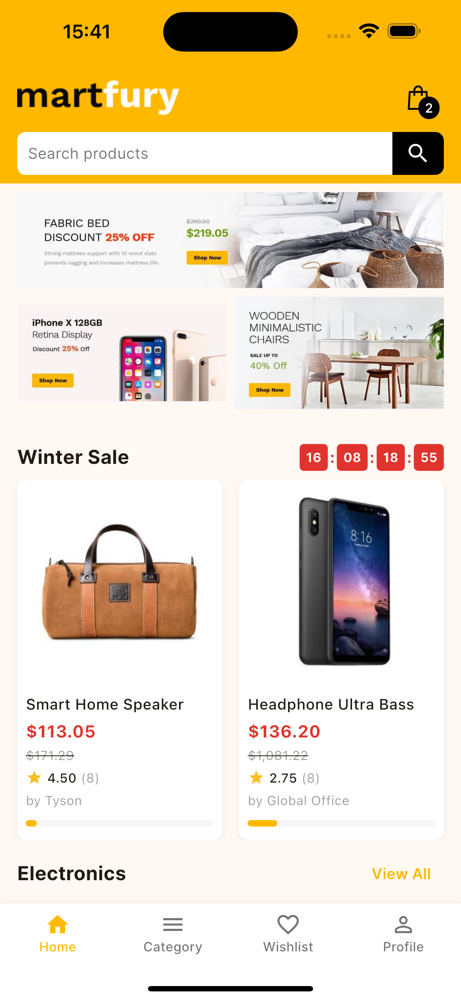

# MartFury - Flutter E-commerce App for Botble

MartFury is a feature-rich Flutter mobile application designed to work with Botble E-commerce backend. This app provides a complete e-commerce experience with a modern UI and seamless integration with Botble's API. It serves as the mobile client for the [MartFury Multipurpose Laravel Ecommerce System](https://codecanyon.net/item/martfury-multipurpose-laravel-ecommerce-system/29925223).



## Features

- **Multi-language Support**: English and Vietnamese localization
- **User Authentication**: Login, registration, and password recovery
- **Product Browsing**: Browse products by categories, featured items, and flash sales
- **Product Details**: View detailed product information, variations, and reviews
- **Shopping Cart**: Add products to cart, update quantities, and remove items
- **Wishlist Management**: Save favorite products for later
- **Checkout Process**: Seamless checkout with multiple payment options
- **Order History**: Track and manage orders
- **User Profile**: Manage personal information and preferences
- **Search Functionality**: Find products quickly with search feature
- **Recently Viewed Products**: Track and display recently viewed items

## Requirements

- Flutter SDK 3.7.2 or higher
- Dart SDK 3.0.0 or higher
- Botble E-commerce backend (API endpoint)
- Android Studio / VS Code

## Installation

### 1. Clone the repository

```bash
git clone https://github.com/yourusername/martfury-flutter.git
cd martfury-flutter
```

### 2. Install dependencies

```bash
flutter pub get
```

### 3. Configure environment variables

Create a `.env` file in the root directory based on the `.env.example` template:

```
# API Configuration
API_BASE_URL=https://your-botble-ecommerce-api.com
APP_NAME=MartFury
APP_ENV=development
TEST_EMAIL=your-test-email@example.com
TEST_PASSWORD=your-test-password
```

### 4. Run the application

```bash
flutter run
```

## Project Structure

```
lib/
├── core/                  # Core functionality and configuration
├── main.dart              # Application entry point
└── src/
    ├── controller/        # Business logic controllers
    ├── model/             # Data models
    ├── service/           # API services and data providers
    ├── theme/             # App theme and styling
    └── view/              # UI components
        ├── screen/        # App screens
        └── widget/        # Reusable widgets
```

## Integration with Botble E-commerce

This app is designed to work with [Botble's MartFury Multipurpose Laravel Ecommerce System](https://codecanyon.net/item/martfury-multipurpose-laravel-ecommerce-system/29925223), a comprehensive e-commerce solution available on CodeCanyon. The mobile app connects to the Botble API endpoints to fetch and manage data.

### API Documentation

The app integrates with the Botble E-commerce API, which is documented at [https://ecommerce-api.botble.com/docs](https://ecommerce-api.botble.com/docs). The API provides endpoints for:

- Authentication (login, register, password recovery)
- Product browsing and searching
- Shopping cart management
- Checkout process
- Order management
- User profile management
- Wishlist functionality
- Reviews and ratings
- Address management
- And more

### Backend Requirements

To use this mobile app, you need to have a running instance of the MartFury Laravel E-commerce system. The backend provides:

- RESTful API for mobile integration
- Multi-vendor marketplace capabilities
- Product management system
- Order processing
- Payment gateway integration
- Customer management

Make sure your Botble backend is properly configured and accessible via the API URL specified in your `.env` file.

## Customization

### Theming

You can customize the app's appearance by modifying the theme settings in `lib/src/theme/`.

### API Configuration

API endpoints and configuration can be adjusted in the `lib/core/app_config.dart` file.

## Development

### Architecture

This app follows a clean architecture approach with:
- **Model**: Data structures and business logic
- **View**: UI components and screens
- **Controller**: Business logic and state management using GetX
- **Service**: API communication and data providers

### State Management

The app uses GetX for state management, routing, and dependency injection. Key features include:
- Reactive state management with `Rx` variables
- Dependency injection with `Get.put()` and `Get.find()`
- Navigation with `Get.to()` and related methods

### Localization

Localization is implemented using the `easy_localization` package:
- Translation files are stored in `assets/translations/`
- Currently supports English (`en.json`) and Vietnamese (`vi.json`)
- Add new languages by creating additional JSON files

### Adding New Features

To add new features to the app:

1. **Create Models**: Define data structures in the `model` directory
2. **Add API Services**: Implement API calls in the `service` directory
3. **Create Controllers**: Add business logic in the `controller` directory
4. **Build UI**: Create screens and widgets in the `view` directory

### Building for Production

To build the app for production:

```bash
# For Android
flutter build apk --release

# For iOS
flutter build ios --release
```

### Testing

Run tests with:

```bash
flutter test
```

## Contributing

Contributions are welcome! Please feel free to submit a Pull Request.

## License

This project is licensed under the [MIT License](LICENSE).

## Usage Guide

### Authentication

1. **Sign Up**: Create a new account by providing your email, name, and password
2. **Sign In**: Log in with your registered email and password
3. **Password Recovery**: Use the "Forgot Password" feature to reset your password

### Shopping

1. **Browse Products**: Explore products by categories or featured collections
2. **Search**: Use the search bar to find specific products
3. **Product Details**: Tap on a product to view its details, images, and reviews
4. **Add to Cart**: Select product variations (if available) and add to your cart
5. **Wishlist**: Save products to your wishlist by tapping the heart icon
6. **Cart Management**: Review your cart, update quantities, or remove items
7. **Checkout**: Complete your purchase by following the checkout process
8. **Order Tracking**: View your order history and track current orders

### User Profile

1. **Profile Management**: Update your personal information
2. **Address Book**: Manage your shipping and billing addresses
3. **Order History**: View past orders and their details
4. **Settings**: Adjust app preferences and notifications

## Troubleshooting

### Common Issues

1. **Connection Issues**:
   - Ensure you have a stable internet connection
   - Verify that the API URL in your `.env` file is correct
   - Check if the Botble backend server is running

2. **Login Problems**:
   - Make sure you're using the correct email and password
   - Try resetting your password if you can't remember it
   - Check if your account is active on the Botble platform

3. **App Crashes**:
   - Ensure you have the latest version of the app
   - Try clearing the app cache
   - Reinstall the app if problems persist

### Reporting Bugs

If you encounter any bugs or issues, please report them by:
1. Opening an issue on GitHub
2. Providing detailed steps to reproduce the problem
3. Including information about your device and app version

## About MartFury Laravel E-commerce System

The backend system that powers this Flutter app is the [MartFury Multipurpose Laravel Ecommerce System](https://codecanyon.net/item/martfury-multipurpose-laravel-ecommerce-system/29925223), which offers:

- **Multivendor & Marketplace**: Easy to enable/disable multivendor features
- **Full E-commerce Features**: Product catalog, attributes, variations, collections, discounts, shipping
- **Multi-language Support**: Unlimited languages support
- **Multi-currency Support**: Unlimited currencies support
- **Full RTL Support**: For right-to-left languages
- **Multiple Payment Gateways**: PayPal, Stripe, Paystack, Razorpay, Mollie, SSLCommerz
- **SEO & Sitemap Support**: Optimized for search engines
- **Powerful Media System**: Support for Amazon S3, DigitalOcean Spaces
- **Powerful Permission System**: Manage users, teams, roles by permissions
- **Beautiful Theme**: Ready to use with color schemes to match your taste

For more information about the backend system, visit the [MartFury Laravel E-commerce System page on CodeCanyon](https://codecanyon.net/item/martfury-multipurpose-laravel-ecommerce-system/29925223).

## Credits

- Developed for Botble E-commerce platform
- Built with Flutter
