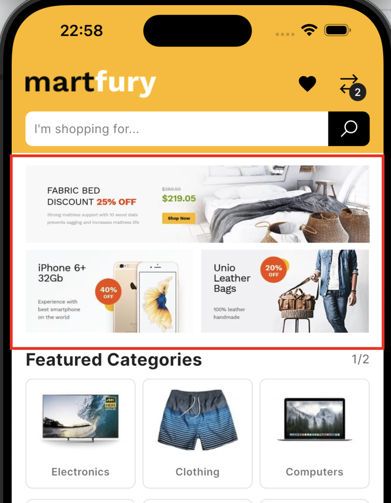
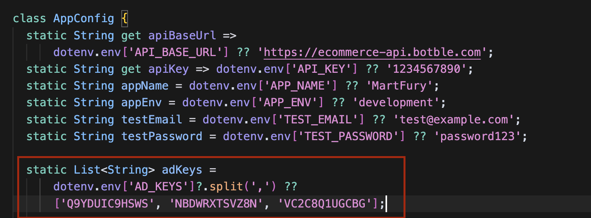
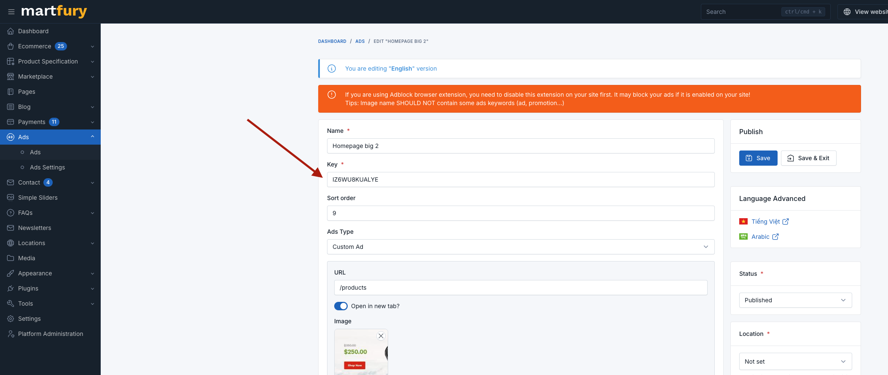

# Setting Up Ad Keys

## Home Screen Ad Configuration
The app uses a flexible ad system that dynamically displays ads based on the configured ad keys. The ads are displayed in a responsive layout:

1. **Large Banner Ad** - Displayed when there's an odd number of ads
2. **Small Banner Ads** - Displayed in pairs of two ads per row



## Configuration Methods

### Method 1: Environment Variables (Recommended)
The app supports environment variable configuration for ad keys. This is the recommended approach for production deployments.

1. Create or update your `.env` file in the root directory
2. Add the following ad key variable:
   ```env
   AD_KEYS=key1,key2,key3,key4,key5
   ```
   
   **Example:**
   ```env
   AD_KEYS=Q9YDUIC9HSWS,NBDWRXTSVZ8N,VC2C8Q1UGCBG
   ```

### Method 2: Direct Code Configuration
You can also configure ad keys directly in the code by modifying `lib/core/app_config.dart`:

```dart
static List<String>? adKeys = dotenv.env['AD_KEYS']?.split(',');
```

## Default Behavior
- If no `AD_KEYS` environment variable is set, the app will not display any ads
- The ad section will be completely hidden when no ads are configured
- This allows for easy disabling of ads by simply not setting the environment variable

## How Ads Are Displayed
The app automatically handles the layout based on the number of ads returned from the API:

- **Odd number of ads**: First ad is displayed as a large banner, remaining ads are displayed in pairs
- **Even number of ads**: All ads are displayed in pairs of small banners
- **No ads**: Ad section is completely hidden (`SizedBox.shrink()`)

## Admin Panel Configuration
These ad keys correspond to the ad placements in your admin panel. You can set the actual ad content for each key in your admin panel at `https://your-domain/admin/ads`.

## Environment Variable Priority
The app follows this priority order for ad key configuration:
1. Environment variables (`.env` file) - `AD_KEYS` variable
2. No ads displayed if no environment variable is set

## API Integration
The app fetches ads using the following API endpoint:
```
GET /api/v1/ads?keys[]=key1&keys[]=key2&keys[]=key3
```

The ads are fetched automatically when the home screen loads and are managed by the `AdService`. If no ad keys are configured, the service returns an empty list and no API call is made.

## Error Handling
- If there's an error loading ads, an error message is displayed
- If no ads are configured or returned, the ad section is hidden gracefully
- The app continues to function normally even if ad loading fails

## Screenshots

*Example of ad key configuration in app_config.dart*


*Example of ad configuration in admin panel*

## Troubleshooting
- If ads are not loading, check that your ad keys are correctly configured in the `AD_KEYS` environment variable
- Ensure your admin panel has content set for the configured ad keys
- Verify that the API endpoint is accessible and returning ad data
- Check the app logs for any ad-related error messages
- Make sure the ad keys are comma-separated without spaces in the environment variable
- If you want to disable ads completely, simply don't set the `AD_KEYS` environment variable
